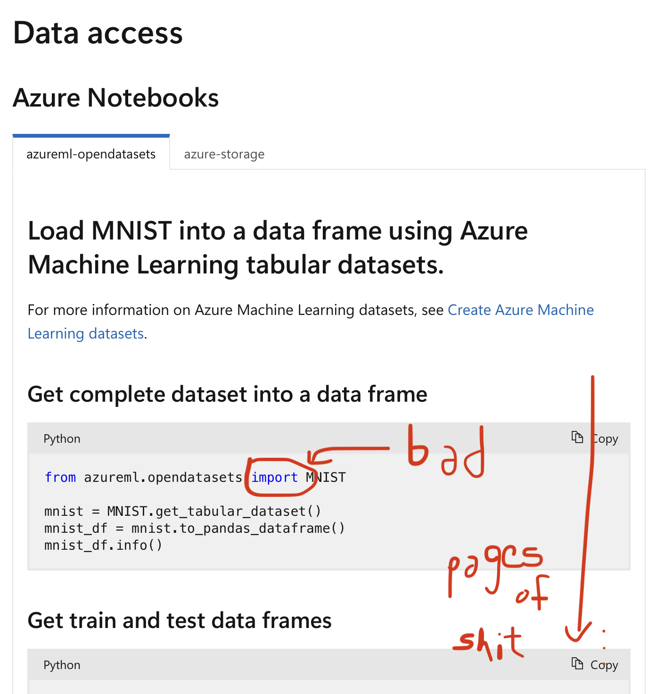
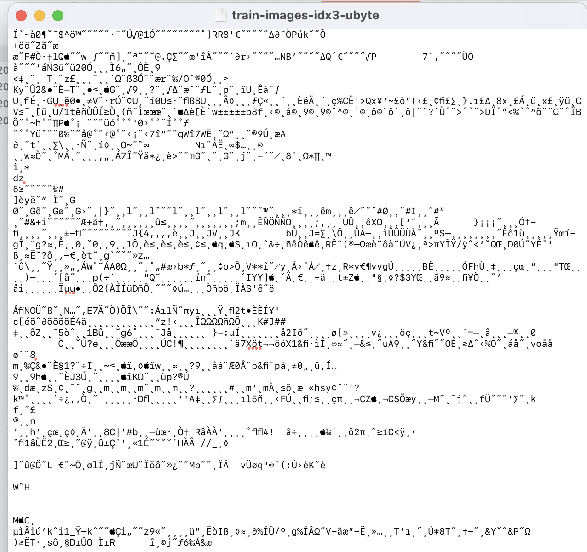
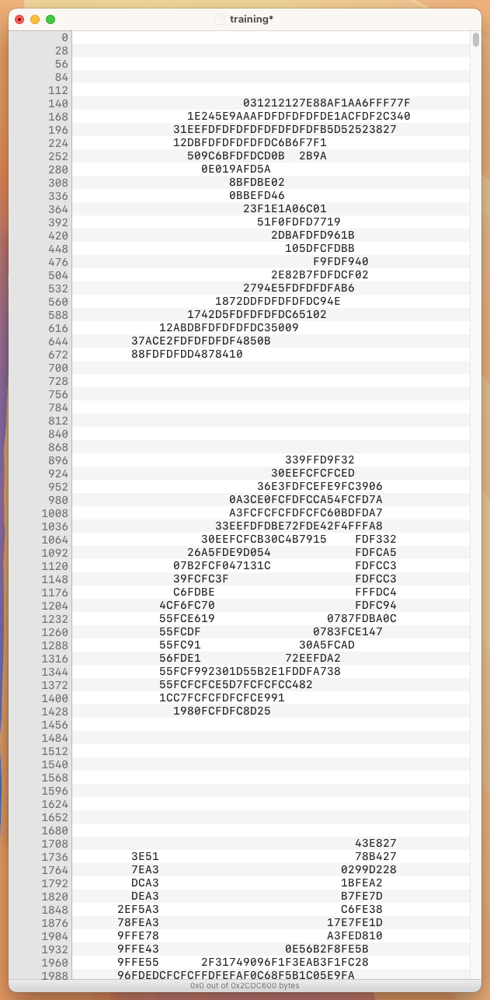
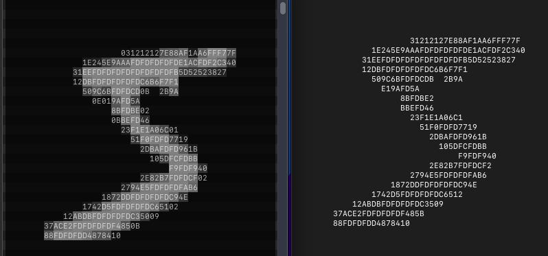
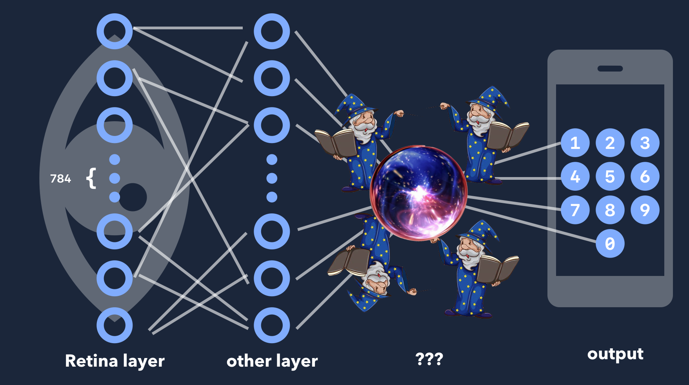

Alright so it looks like I'm gonna have to go see about what it is all the kids are talking about in 2025.

**the goal:** to make a "neural network" with my bare hands and C  with no libraries.

**disclaimer:** I'm not counting `stdio.h` as an import.
Nothing else, though.

### Day 1:

First things first, I hear neural networks (NNs) need training data.
I think I want the MNIST handwritten digits; I've been told it's the `"Hello World!"` of NNs.
But when I went to go find it, I was immediately hit with some library bullshit.





Nonetheless, some light searching got me to the [raw files](https://github.com/cvdfoundation/mnist) (don't you just love the words "raw files"?), but it appears I can't quite decipher them...they're like, straight-up binary or something?



So TextEdit (macOS default text editor) isn't really a true fiend who looks at raw files with hex or binary encoding.
It's gonna want to use something woke, like UTF-8 or UTF-16.
So I asked a friend and he pointed me to [Hex Fiend](https://hexfiend.com), a true fiend.
A `5.4 MB` app—pretty cool.
Now I can open the dataset and see a bunch of hex numbers!
And if I remove the header and scale my window just right...



There are my numbers!
What is four bytes called? I think I'll call it a chomp.
Well, I think the first four chomps are telling me about the data.
It's a 3-dimensional array in *unsigned* bytes.
Each image is [`0x1C`](https://en.wikipedia.org/wiki/28_(number)) by [`0x1C`](https://en.wikipedia.org/wiki/28_(number)), and there are [`0xEA60`](./base.c) of them.

I need to read the file, or at least one image of it at a time.
On first attempt, C gave me some wrong numbers.
Fortunately, it was my time to become a man and learn about [endianness](https://en.wikipedia.org/wiki/Endianness).
So the standard file-reading `fread()` is trying to read in little-Endian, where the first bit you read is the "1's place", followed by the "2's place" and so on; I need to read in big-Endian, where the first bit is the biggest portion, just like when humans read numbers.
This is fixed by running following bit shifts on each byte:

```c
x = (x>>24) | ((x<<8) & 0x00FF0000) | ((x>>8) & 0x0000FF00) | (x<<24);
```

### Day 2:

Today I'm learning how to do math with `unsigned char` types just like the founding fathers intended.
Basically, I was reading my training data into a buffer of `int`egers, but that's a problem because an `int` is four bytes long and each pixel of training data is only one byte.
Also remember those bitshifts for changing the endianness?
I shot myself in the foot there—it's not the same for `unsigned char` numbers.
And it's working without them, so I guess C reads in big-Endian when it's reading into `unsigned char`.
The good news is, these `unsigned char`s actually have addition and multiplication built-in—C knows that we're going to use its types for more than just strings. Also, I can now read a full image (784 bytes) onto my buffer.
This is the "retina", the first layer of neurons!



Next, we need more "layers" in order to fill out our structure.
Then, like in any good C project, we pass the data onto a team of wizards who discover patterns using reflections in the Orb of Linear Algebra.
Finally, the wizards grant us the result in the form of "confidence" probabilities for each digit 0 through 9.



Hence, the next step is to forge the Orb itself and implement matrices in C.
It's a pain, but I'm hardcoding the different sizes of the vectors and matrices (known at compile-time) cause I think it will be faster than making an extendable type on the heap.

### Day 3:

Floating point numbers are for losers and babies and I'm going to make all the matrices run on `unsigned char` operations.
These values describe the neuron activations and the connection weights between them, and they represent values in $ℝ[0, 1]$.
So I'm using the `unsigned char` byte itself to represent some hexadecimal fraction between zero and one (like, 0xA1 is really 0x0.A1).

You know how multiplying decimals works, where like $0.13 × 0.13 = 0.169$, where $13 × 13 = 169$?
It's like that, but for hexadecimal.
I deal with overflow by using a 16-bit `unsigned short`, twice as big as the 8-bit `unsigned char`.
```c
unsigned char add(unsigned char lhs, unsigned char rhs) {
    unsigned short sum = lhs + rhs;
    unsigned char out;
    if (sum >> 8 == 0x0) { out = sum; }
    else { out = 0xFF; // maximum value if too big }
    return out;
}
unsigned char mul(unsigned char lhs, unsigned char rhs) {
    unsigned short product = lhs * rhs;
    return product >> 8;
    // short >> 8 is just its first (bigger) byte
}
```
Now I have a working neural network, which solves some unknown and useless problem.
I need to get the wizards to train our network to solve the problem we *want*, namely reading numbers.
To do this, we need a **cost function** and some way to differentiate that cost function in many dimensions, for the **gradient**.

The easiest cost function I can come up with is to square all the confidence in wrong answers and square all the lack of confidence in the answer.
Unfortunately, even though our single-byte arithmetic is really cool, we need the cost function to be really precise in order to find derivatives.
But we only need to calculate the cost once per image so it's fine to use a `float`.