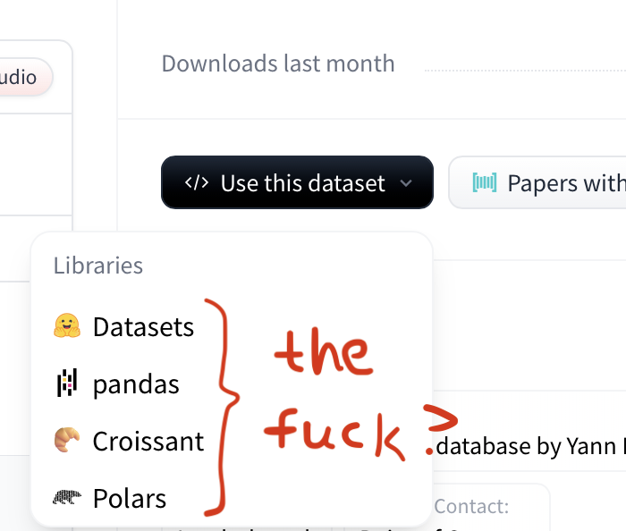
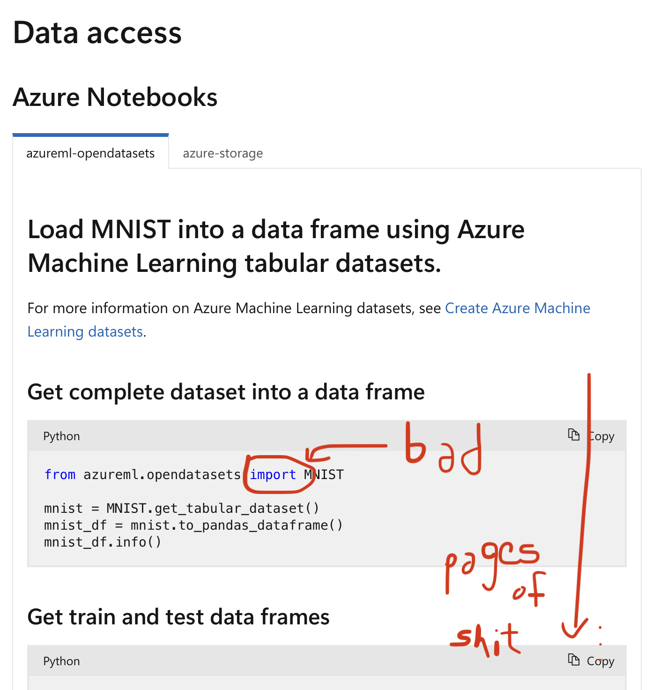
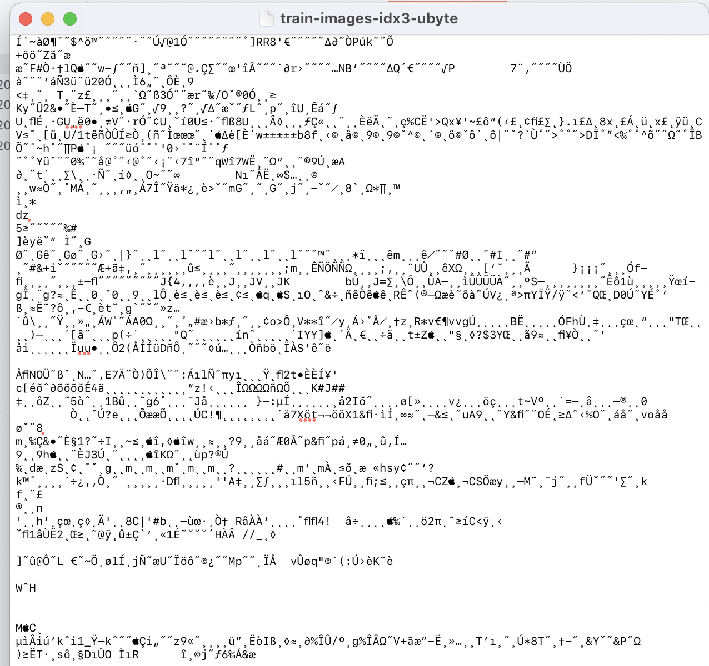
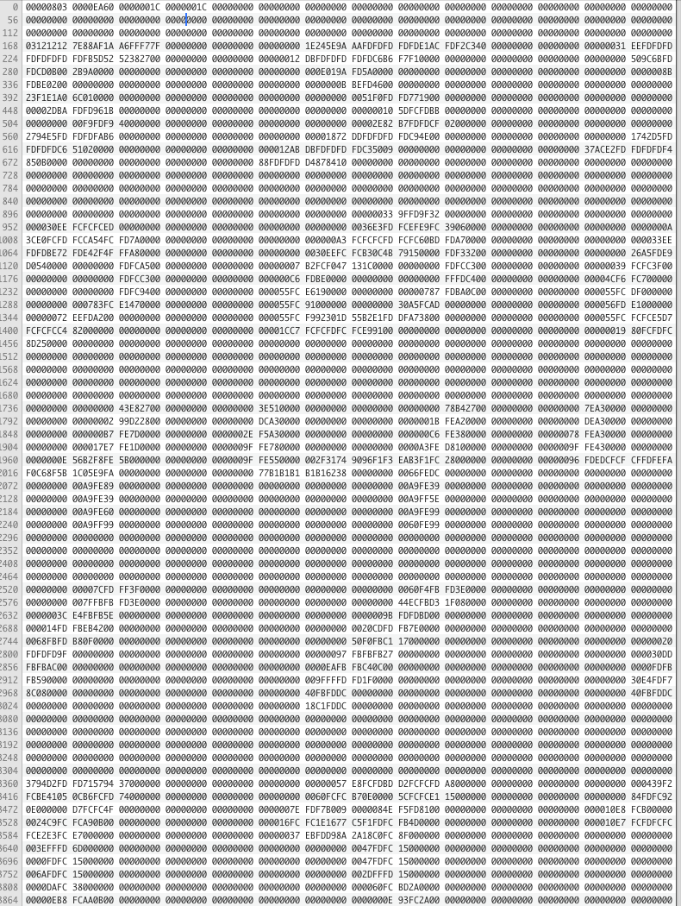

Alright so it looks like I'm gonna have to go see about what it is all the kids are talking about in 2025.

**the goal:** to make a "neural network" with my bare hands and no libraries.

### Day 1:

First things first, I hear neural networks (NNs) need training data.
I think I want the MNIST handwritten digits; I've been told it's the `"Hello World!"` of NNs.
But when I went to go find it, I was immediately hit with some library bullshit.





Nonetheless, some light searching got me to the [raw files](https://github.com/cvdfoundation/mnist) (don't you just love the words "raw files"?), but it appears I can't quite decipher them...they're like, straight-up binary or something?



So TextEdit (macOS default text editor) isn't really a true fiend who looks at raw files with hex or binary encoding.
It's gonna want to use something woke, like UTF-8 or UTF-16.
So I asked a friend and he pointed me to [Hex Fiend](https://hexfiend.com), a true fiend.
A `5.4 MB` app—pretty cool.
Now I can open the dataset and see a bunch of hex numbers!
And if I remove the header and scale my window just right...



There are my numbers!
What is four bytes called? I think I'll call it a chomp.
Well, I think the first four chomps are telling me about the data.
It's a 3-dimensional array in *unsigned* bytes.
Each image is [`0x1C`](https://en.wikipedia.org/wiki/28_(number)) by [`0x1C`](https://en.wikipedia.org/wiki/28_(number)), and there are [`0xEA60`](./base.c) of them.

I need to read the file, or at least one image of it at a time.
On first attempt, C gave me some wrong numbers.
Fortunately, it was my time to become a man and learn about [endianness](https://en.wikipedia.org/wiki/Endianness).
So the standard file-reading `fread()` is trying to read in little-Endian, where the first bit you read is the "1's place", followed by the "2's place" and so on; I need to read in big-Endian, where the first bit is the biggest portion, just like when humans read numbers.
This is fixed by running following bit shifts on each byte:

```c
x = (x>>24) | ((x<<8) & 0x00FF0000) | ((x>>8) & 0x0000FF00) | (x<<24);
```

### Day 2:

Today I'm learning how to do math with `unsigned char` types just like the founding fathers intended.
Basically, I was reading my training data into a buffer of `int`egers, but that's a problem because an `int` is four bytes long and each pixel of training data is only one byte.
Also remember those bitshifts for changing the endianness?
I shot myself in the foot there—it's not the same for `unsigned char` numbers.
And it's working without them, so I guess C reads in big-Endian when it's reading into `unsigned char`.
The good news is, I can now read a full image (784 bytes) onto my buffer.
This is the "retina", the first layer of neurons!