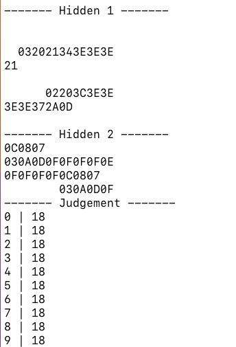

# Baby's First Neural Network

Alright so it looks like I'm gonna have to go see about what it is all the kids are talking about in 2025.

**the goal:** to make a "neural network" with my bare hands and C  with no libraries.
I'll basically be re-creating the example used by [3blue1brown](https://www.youtube.com/@3blue1brown).

**disclaimer:** I'm not counting `stdio.h` as an import.
Nothing else, though.

### Day 1:

First things first, I hear neural networks (NNs) need training data.
I think I want the MNIST handwritten digits; I've been told it's the `"Hello World!"` of NNs.
But when I went to go find it, I was immediately hit with some library bullshit.


Nonetheless, some light searching got me to the [raw files](https://github.com/cvdfoundation/mnist) (don't you just love the words "raw files"?), but it appears I can't quite decipher them...they're like, straight-up binary or something?


So TextEdit (macOS default text editor) isn't really a true fiend who looks at raw files with hex or binary encoding.
It's gonna want to use something woke, like UTF-8 or UTF-16.
So I asked a friend and he pointed me to [Hex Fiend](https://hexfiend.com), a true fiend.
A `5.4 MB` app—pretty cool.
Now I can open the dataset and see a bunch of hex numbers!
And if I remove the header and scale my window just right...


There are my numbers!
What is four bytes called? I think I'll call it a chomp.
Well, I think the first four chomps are telling me about the data.
It's a 3-dimensional array in *unsigned* bytes.
Each image is [`0x1C`](https://en.wikipedia.org/wiki/28_(number)) by [`0x1C`](https://en.wikipedia.org/wiki/28_(number)), and there are [`0xEA60`](./base.c) of them.

I need to read the file, or at least one image of it at a time.
On first attempt, C gave me some wrong numbers.
Fortunately, it was my time to become a man and learn about [endianness](https://en.wikipedia.org/wiki/Endianness).
So the standard file-reading `fread()` is trying to read in little-Endian, where the first bit you read is the "1's place", followed by the "2's place" and so on; I need to read in big-Endian, where the first bit is the biggest portion, just like when humans read numbers.
This is fixed by running following bit shifts on each byte:

```c
x = (x>>24) | ((x<<8) & 0x00FF0000) | ((x>>8) & 0x0000FF00) | (x<<24);
```

### Day 2:

Today I'm learning how to do math with `unsigned char` types just like the founding fathers intended.
Basically, I was reading my training data into a buffer of `int`egers, but that's a problem because an `int` is four bytes long and each pixel of training data is only one byte.
Also remember those bitshifts for changing the endianness?
I shot myself in the foot there—it's not the same for `unsigned char` numbers.
And it's working without them, so I guess C reads in big-Endian when it's reading into `unsigned char`.
The good news is, these `unsigned char`s actually have addition and multiplication built-in—C knows that we're going to use its types for more than just strings. Also, I can now read a full image (784 bytes) onto my buffer.
This is the "retina", the first layer of neurons!


Next, we need more "layers" in order to fill out our structure.
Then, like in any good C project, we pass the data onto a team of wizards who discover patterns using reflections in the Orb of Linear Algebra.
Finally, the wizards grant us the result in the form of "confidence" probabilities for each digit 0 through 9.


Hence, the next step is to forge the Orb itself and implement matrices in C.
It's a pain, but I'm hardcoding the different sizes of the vectors and matrices (known at compile-time) cause I think it will be faster than making an extendable type on the heap.

### Day 3:

Floating point numbers are for losers and babies and I'm going to make all the matrices run on `unsigned char` operations.
These values describe the neuron activations and the connection weights between them, and they represent values in $ℝ[0, 1]$.
So I'm using the `unsigned char` byte itself to represent some hexadecimal fraction between zero and one (like, 0xA1 is really 0x0.A1).

You know how multiplying decimals works, where like $0.13 × 0.13 = 0.169$, where $13 × 13 = 169$?
It's like that, but for hexadecimal.
I deal with overflow by using a 16-bit `unsigned short`, twice as big as the 8-bit `unsigned char`.
```c
unsigned char add(unsigned char lhs, unsigned char rhs) {
    unsigned short sum = lhs + rhs;
    unsigned char out;
    if (sum >> 8 == 0x0) { out = sum; }
    else { out = 0xFF; // maximum value if too big }
    return out;
}
unsigned char mul(unsigned char lhs, unsigned char rhs) {
    unsigned short product = lhs * rhs;
    return product >> 8;
    // short >> 8 is just its first (most significant) byte
}
```
Now I have a working neural network, which solves some unknown and useless problem.
I need to get the wizards to train our network to solve the problem we *want*, namely reading numbers.
To do this, we need a **cost function** and some way to differentiate that cost function in many dimensions, for the **gradient**.

I just thought of something—there's a few more problems with our tiny datatype.
- They can't do negative edgeweights, so they're all gonna have to be nonnegative.
- With my multiplication, it's pretty easy to get 0x00, so there might not be enough "light" in the network, and we get a bunch of 0x00 as our result.
- With my addition, it's pretty easy to get 0xFF, so there might be too much "light" and we get a bunch of 0xFE as our result.

Will we have to switch to `float` like losers?
If we do, you'll know that my GitHub account has been hacked, because I would never be a loser.
For my first processing, though, I just calibrated the weights such that I wasn't stuck with 0x00 or 0xFF.




Look at that!
We can peer into the hidden layers and see what's lighting up!
And guess what?
I'm now calculating gradients for all the layers and edgeweights, and I've got the infrastructure to modify the network according to the gradient!

**problem:** The judgement is converging to a bunch of 0xFF.
Remember that the `unsigned char` can't be negative?
Well that means my gradients are all positive, and my edgweights just keep going up...

### Day 4:

I need negative numbers.
Will I rejoin **society** and use a `float`?
Of course not.
That would require 32 bits instead of just 8.
And I didn't implement floating point numbers by myself (I'll do that later).

**the plan:** 
One option is just a signed `char` type.
It's still super small and fast (the same 1 byte), but one of the bits is a sign.
The only problem here is that we're taking away a bit from the number,
```c
unsigned char usgn_min = 0x00; char sgn_min = -0x7F;
unsigned char usgn_max = 0xFF; char sgn_max =  0x7F;
```
and I think it would cause problems if we interpreted the unsigned input as negative numbers.
But if I were to keep the retina `unsigned`, but make some new operations such that the edges and the other layers are all `signed`, I might sidestep the issue.
Nonetheless, this isn't without downsides—my 0xFF problem is about to become a 0x7F problem.

I was wrong!
After changing all my `unsigned char`s into `chars`, I **don't** have a 0x7F problem—I have a -0x7F problem!
Or, as C's printing mechanism likes to call it, a 0xFFFFFF80 problem!
Yeah, whenever you print in hex with `"%X"`, C assumes the input is an `int` and not one byte, so you get extra data.
Took me a long time to figure that one out.
Thanks, C!
So I print my judgements as decimal numbers with `"%d"` now.


### Day 5:

All right!
Our -0x7F problem is solved!
I just, uh... made my `char` addition wrong...
```c
char add(char lhs, char rhs) {
    // this is the correct addition now don't worry
    short sum = lhs + rhs;
    char out;
    if (sum > 0x7F) { out = 0x7F; } // cap the positive numbers
    else if (sum < -0x7F) { out = -0x7F; } // cap the negative numbers
    else { out = sum; }
    return out;
}
```
But now it's all better!
In fact, I can track my network "learning" very slowly now (and not immediately pushing the output to -127).


I call my $32 → 10$ matrix Lumen Three, and the others Lumen One and Lumen Two.
I just thought they needed names, and I like the idea of the matrices filtering the "light" through the layers of the network.

I'm getting close; I can feel it.
Right now, however, as seen in the screenshot, my network isn't actually outputting 5 like I want it to.
Its training converges in some random negative value (but not the minimum) for every digit.

I just arbitrarily changed the initial Lumens and... it just worked **it just worked** it just trained itself it just **trained and like** it did the


I mean, it's not doing particularly well, but it *does* seem like there is a *preference* for the number 5 here—which is the goal.
I'm training it to tell me "five! hooray!" everytime.